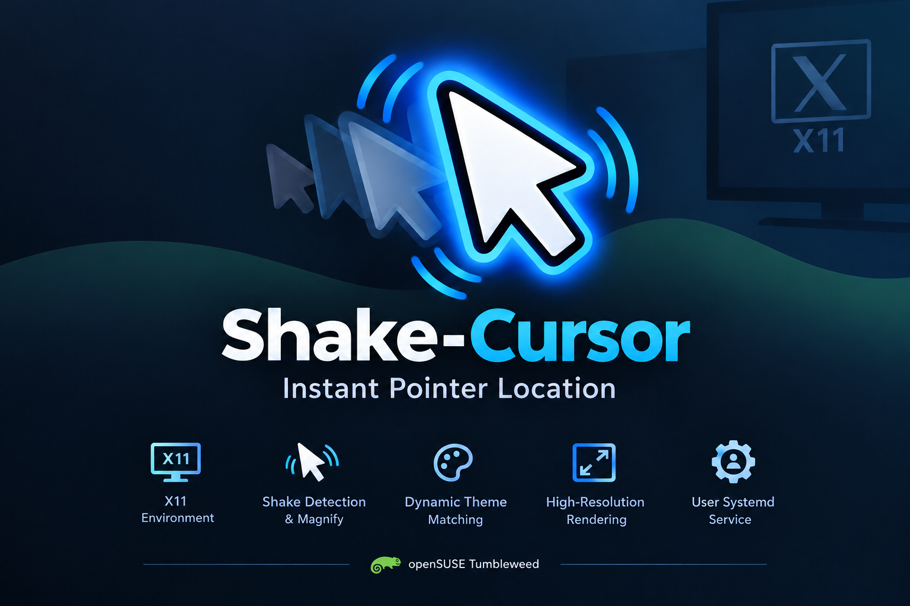

# Shake-Cursor: Instant Pointer Location

<p align="center">
  
</p>

Shake-Cursor is a lightweight background utility for X11 that helps you instantly locate your mouse pointer like wayland and macOS by detecting rapid mouse movements and temporarily enlarging the cursor. Designed for modern desktops and large, high-resolution displays, including 4K monitors, it uses high-resolution rendering to keep the enlarged pointer sharp and clear, minimizing pixelation. It also supports dynamic cursor theme matching and integrates seamlessly with your desktop session through a user-level systemd service.

## Requirements

- X11
- libXcursor-devel
- libinput-devel
- libXi-devel
- adwaita-icon-theme
- dmz-icon-theme-cursors
- xcursor-themes

## Compile

```bash
gcc -o shake-cursor shake-cursor.c -lX11 -lXcursor -lXrender -lXfixes -lXi -lm -O3
```

## Installation

```bash
# Install the binary
sudo install -m 0755 shake-cursor /usr/bin/shake-cursor

# Create the user systemd directory if it doesn't exist
mkdir -p ~/.config/systemd/user/

# Copy the service file
cp shake-cursor.service ~/.config/systemd/user/
```

## Run on system startup
```bash
systemctl --user daemon-reload
systemctl --user enable --now x11-shake-cursor.service
```

## Usage

Shake mouse fast = big cursor.<br>
Stop shaking = normal cursor.
<br>
<br>
## Credits:
Developed by [Jonatas Gonçalves](https://www.linkedin.com/in/jonatasgon%C3%A7alves/)
<a href="https://www.linkedin.com/in/jonatasgon%C3%A7alves/">
  
</a><br>
Maintained on [openSUSE Tumbleweed](https://build.opensuse.org/package/show/home:MaxxedSUSE/shake-cursor) 🦎<br>
This project is adapted from the concept found in [x11_shake_to_magnify_cursor](https://github.com/adelmonte/x11_shake_to_magnify_cursor) by adelmonte.<br>
